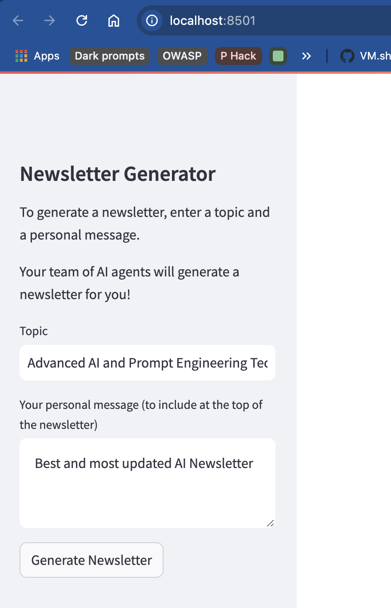
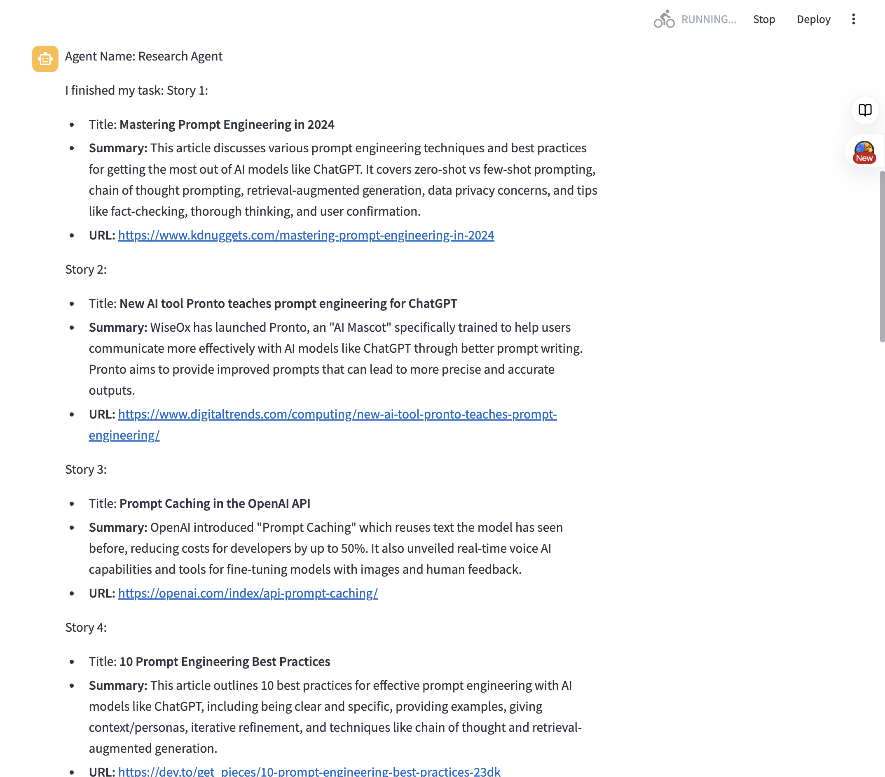

# Auto NewsletterGen Crew with GUI
This is an a multi-agent system that generates a newsletter on a given topic, with a personal message from the user.


## Prerequisites
- Python 3.10 or later
- Poetry
- An OpenAI API key Environment Variable (OPENAI_API_KEY)
- An Anthropic API key Environment Variable (ANTHROPIC_API_KEY)

### To Run GUI
- Streamlit
- EXA API key Environment Variable (EXA_API_KEY)

## Installation

Ensure you have Python >=3.10 <=3.13 installed on your system. This project uses [Poetry](https://python-poetry.org/) for dependency management and package handling, offering a seamless setup and execution experience.

First, if you haven't already, install Poetry:

```bash
pip install poetry
```

Next, navigate to your project directory and install the dependencies:

1. First lock the dependencies and then install them:
```bash
poetry lock
```
```bash
poetry install
```

## Running the Project

To kickstart the AI agents crew and begin task execution, run this from the root folder of the project:

```bash
poetry run auto_newsletter_gen
```

### Running the Project for GUI
To kickstart the GUI, run this from the root folder of the project:

```bash
cd gui
streamlit run app.py
```


## Outputs: - Current version all outputs are saved in the `logs` folder
1. Research:
    - A result of the research will be saved in the `logs/{date}_research_task.md` markdown file.
2. Editorial:
    - An editorial will be saved in the `logs/{date}_edit_task.md` markdown file.
3. Newsletter:
    - A newsletter will be saved in the `logs/{date}_newsletter_task.html` file.


# Demo:

Follow along with our interactive demo to see how the Auto NewsletterGen Crew works!

<details>
<summary>1. Newsletter Generator Input GUI</summary>



Start by entering your topic and personal message in our user-friendly GUI.
</details>

<details>
<summary>2. Research Process</summary>



Our AI agents conduct thorough research on your chosen topic.
</details>

<details>
<summary>3. Editorial Tasks</summary>


The editor agent refines and structures the content for your newsletter.
</details>

<details>
<summary>4. Agent Collaboration</summary>


Watch as our AI agents work together seamlessly to create your newsletter.
</details>

<details>
<summary>5. Newsletter Generation</summary>


The final step: Your personalized newsletter is generated and ready to share!
</details>

Experience the power of AI-driven content creation with Auto NewsletterGen Crew!
